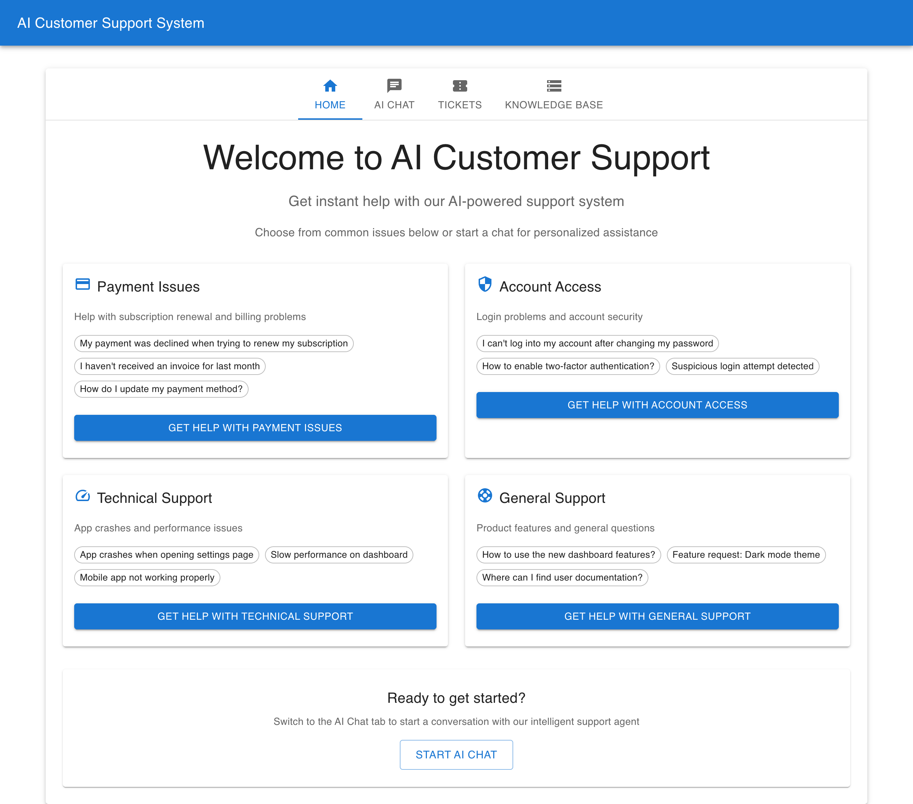
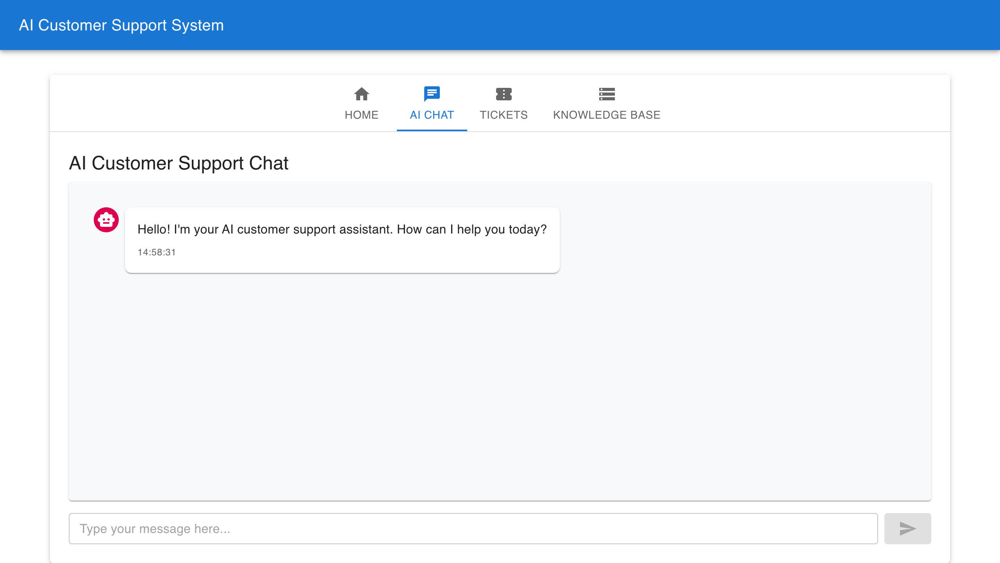
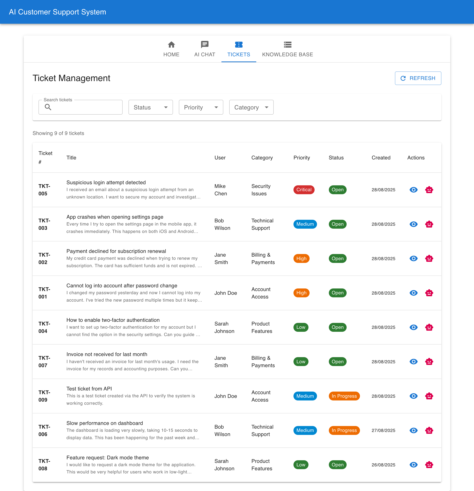
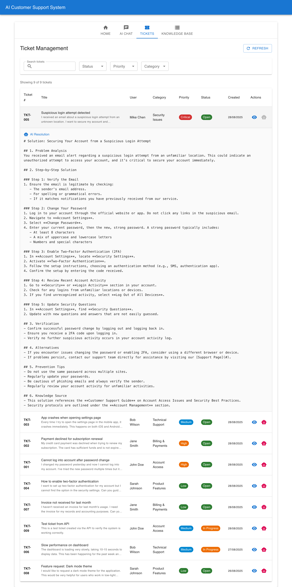
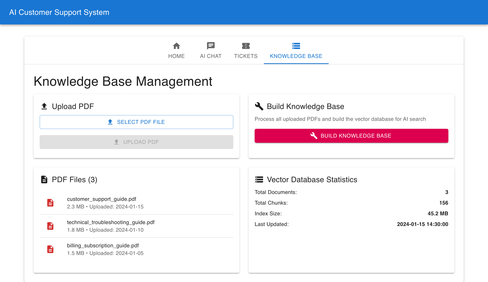
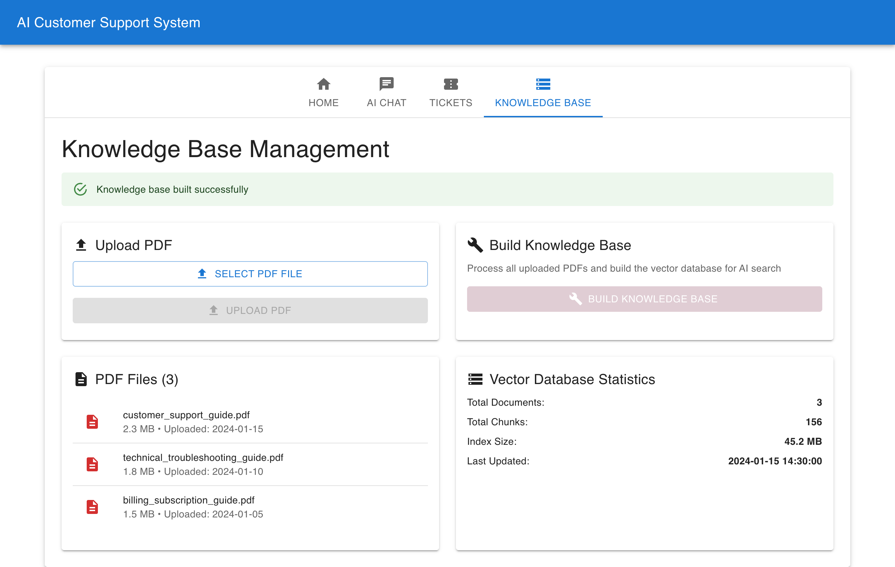
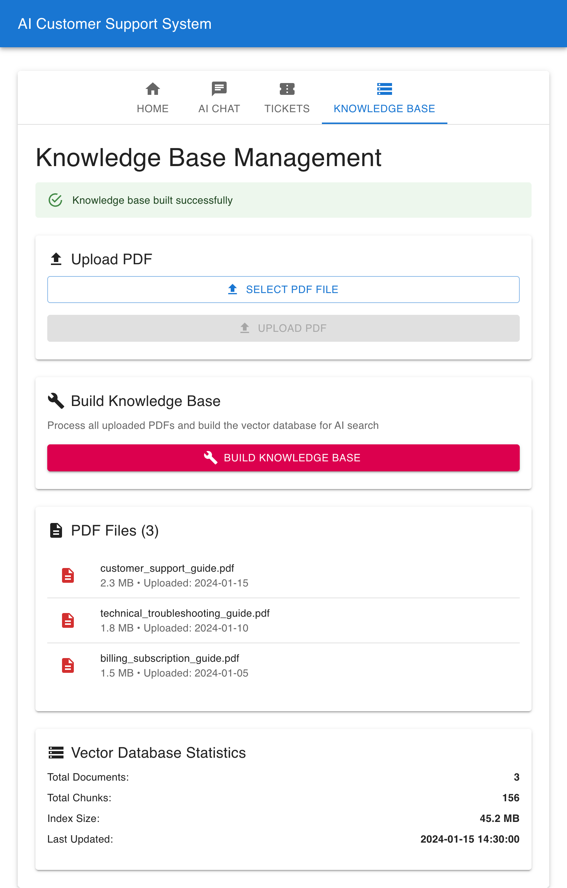

# 🤖 AI Customer Support System - User Manual

## 📋 Table of Contents

1. [System Overview](#system-overview)
2. [Getting Started](#getting-started)
3. [Home Tab](#home-tab)
4. [AI Chat Tab](#ai-chat-tab)
5. [Tickets Tab](#tickets-tab)
6. [Knowledge Base Tab](#knowledge-base-tab)
7. [AI Resolution Feature](#ai-resolution-feature)
8. [Responsive Design](#responsive-design)
9. [Troubleshooting](#troubleshooting)

## 🎯 System Overview

The AI Customer Support System is a comprehensive solution that combines:
- **React-based Web Interface** for intuitive user experience
- **AI-powered Chat Support** using OpenAI GPT models
- **Ticket Management System** with SQLite database
- **Knowledge Base Management** with vector database integration
- **AI Resolution Generation** for automatic ticket solutions

## 🚀 Getting Started

### Prerequisites
- Node.js 16+ installed
- Python 3.8+ installed
- OpenAI API key configured

### Installation
```bash
# Install React dependencies
cd react-web-ui
npm install

# Install Python dependencies
pip install -r requirements.txt
```

### Starting the System
```bash
# Terminal 1: Start FastAPI Backend
python3 fastapi_demo.py

# Terminal 2: Start Ticketing API
cd ticketing_tool
python3 main.py

# Terminal 3: Start React Frontend
cd react-web-ui
npm start
```

## 🏠 Home Tab

The Home tab provides an overview of the system and quick access to key features.



**Features:**
- System overview and welcome message
- Quick navigation to all tabs
- System status information

## 💬 AI Chat Tab

The AI Chat tab allows users to interact directly with the AI support system.



**How to Use:**
1. Type your support query in the input field
2. Click "Send" or press Enter
3. The AI will analyze your query and provide a comprehensive solution
4. Responses include step-by-step instructions and troubleshooting tips

**Example Queries:**
- "I cannot log into my account"
- "My payment was charged twice"
- "The system is running very slow"
- "How do I reset my password?"

## 🎫 Tickets Tab

The Tickets tab provides comprehensive ticket management capabilities.



**Features:**
- **Search & Filter**: Find tickets by status, priority, or category
- **Ticket List**: View all tickets with key information
- **Ticket Details**: Click the eye icon to view full ticket information
- **AI Resolution**: Get AI-generated solutions for each ticket

**Ticket Information Displayed:**
- Ticket number and title
- User information
- Category and priority
- Status and creation date
- Action buttons

## 🤖 AI Resolution Feature

The AI Resolution feature automatically generates comprehensive solutions for support tickets.



**How to Use:**
1. Navigate to the Tickets tab
2. Locate the ticket you want to resolve
3. Click the robot icon (🤖) in the Actions column
4. Wait for the AI to generate a solution
5. View the detailed resolution below the ticket

**AI Resolution Includes:**
- Step-by-step troubleshooting
- Prevention tips
- Alternative solutions
- Related documentation links

## 📚 Knowledge Base Tab

The Knowledge Base tab allows administrators to manage the system's knowledge base.



**Features:**
- **PDF Management**: Upload and manage PDF documents
- **Knowledge Building**: Build vector database from uploaded documents
- **Statistics**: View vector database statistics
- **Document List**: Browse all uploaded knowledge base documents

### Uploading PDFs


**Steps:**
1. Click "Choose File" to select a PDF
2. Ensure the PDF contains relevant support information
3. Click "Upload PDF" to add it to the system
4. The PDF will appear in the documents list

### Building Knowledge Base


**Steps:**
1. Upload all necessary PDF documents
2. Click "Build Knowledge Base" to process documents
3. Wait for the vector database to be updated
4. View statistics to confirm successful processing

## 📱 Responsive Design

The system is designed to work seamlessly across all device sizes.



**Responsive Features:**
- **Desktop**: Full-featured interface with side-by-side layouts
- **Tablet**: Optimized layouts for medium screens
- **Mobile**: Touch-friendly interface with stacked layouts
- **Cross-platform**: Works on Windows, macOS, Linux, iOS, and Android

## 🔧 Troubleshooting

### Common Issues and Solutions

#### AI Chat Not Responding
- **Check**: FastAPI backend is running on port 7777
- **Solution**: Ensure `python3 fastapi_demo.py` is running
- **Verify**: Check console for error messages

#### Tickets Not Loading
- **Check**: Ticketing API is running on port 8000
- **Solution**: Ensure `python3 main.py` is running in ticketing_tool directory
- **Verify**: Check browser console for API errors

#### Knowledge Base Build Failing
- **Check**: OpenAI API key is configured
- **Solution**: Verify `.env` file contains valid `OPENAI_API_KEY`
- **Verify**: Check API quota and limits

#### React App Not Starting
- **Check**: Node.js version (requires 16+)
- **Solution**: Run `npm install` to install dependencies
- **Verify**: Check for port conflicts on 3000

### System Requirements

- **Frontend**: Node.js 16+, npm 8+
- **Backend**: Python 3.8+, pip 20+
- **Database**: SQLite 3.0+ (included with Python)
- **Browser**: Chrome 90+, Firefox 88+, Safari 14+, Edge 90+

### Performance Optimization

- **Vector Database**: Use SSD storage for better performance
- **API Caching**: Enable Redis for production deployments
- **Image Optimization**: Compress screenshots for faster loading
- **CDN**: Use CDN for static assets in production

## 📞 Support

For technical support or feature requests:
- **GitHub Issues**: Create an issue in the repository
- **Documentation**: Check the README.md for detailed setup instructions
- **API Docs**: Visit http://localhost:7777/docs for interactive API documentation

---

*This user manual was automatically generated using Playwright automation. Last updated: 28/08/2025*
